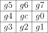

# Reconnaissance d'image


## Description

Ce projet a pour but de mettre en pratique les connaissances acquises en traitement d'image. 

Vous trouverez dans ce projet les fonctionnalités suivantes :

#### 1. Codage de Freeman

Le codage de Freeman est une méthode de description de contours. Il permet de décrire un contour en utilisant une suite de nombres entiers. Chaque nombre correspond à une direction.


#### 2. Descripteur d'image

###### Un constante est définie pour afficher ou non les images.

 - Local Binary Pattern (LBP)

```math
LBP(x_c, y_c) = \sum_{n=0}^{7} 2^ns(i_n - i_c)
```
    
```math
S(x) = \begin{cases}
1 & \text{si } x \leq 0 \\
0 & \text{sinon}
\end{cases}
```
| Image | Histogramme |
:-------------------------:|:-------------------------:
 | 

 - Mean-LBP (M-LBP)

```math
M-LBP(x_c, y_c) = S(f(i-1,j-1) -m)2^3 + S(f(i-1,j) -m)2^2 + S(f(i,j) -m)2^1 + S(f(i,j-1) -m)
```

```math
\text{avec } m = \frac{
    f(i-1,j-1)+(i-1,j)+(i,j)+(i,j-1)
}{4}
```

```math
\text{et } S(x) = \begin{cases}
1 & \text{si } x \leq 0 \\
0 & \text{sinon}
\end{cases}
```

| Image égalisé | Histogramme | Histogramme égalisé |
:-------------------------:|:-------------------------:|:-------------------------:
 |  | 
| Image spécifié | Histogramme | Histogramme spécifié |
 |  | 

- Extended Center-Symmetric Local Binary Pattern (XCS-LBP)

```math
XCS-LBP(gc) =
```

```math
S((g_0 - g_4) + g_c + (g_0 - g_c) * (g_4 - g_c)) * 2^0 +
```

```math
S((g_1 - g_5) + g_c + (g_1 - g_c) * (g_5 - g_c)) * 2^1 +
```

```math
S((g_2 - g_6) + g_c + (g_2 - g_c) * (g_6 - g_c)) * 2^2 +
```

```math
S((g_3 - g_7) + g_c + (g_3 - g_c) * (g_7 - g_c)) * 2^3
```
avec 

<div align="center">



</div>

| Image | Image égalisé | Image spécifié |
:-------------------------:|:-------------------------:|:-------------------------:
 |  | 

| Histogramme | Histogramme égalisé | Histogramme spécifié |
:-------------------------:|:-------------------------:|:-------------------------:
 |  | 


#### 3. Caractéristiques pseudo-haar

Les [caractéristiques pseudo-haar](https://fr.wikipedia.org/wiki/Caract%C3%A9ristiques_pseudo-Haar) sont des caractéristiques utilisées dans la détection de visage. Elles permettent de décrire une zone de l'image en utilisant la différence de somme des pixels dans des zones rectangulaires.

Pour calculer rapidement et efficacement ces caractéristiques, on utilise une [image intégrale](https://fr.wikipedia.org/wiki/Image_int%C3%A9grale). Cette image permet de calculer la somme des pixels dans une zone rectangulaire en utilisant seulement 4 valeurs.
Voir [cette vidéo](https://www.youtube.com/watch?v=5ceT8O3k6os) pour plus d'informations.


## Installation

Dans les paramètres du projet :

C/C++ > Général > Autres répertoires include : Ajouter le chemin vers le dossier include de la bibliothèque OpenCV

Éditeur de liens > Général > Répertoires de bibliothèques supplémentaires : Ajouter le chemin vers le dossier lib de la bibliothèque OpenCV

Éditeur de liens > Entrée > Dépendances supplémentaires : Ajouter les librairies suivantes :

opencv_world460d.lib
opencv_world460.lib
